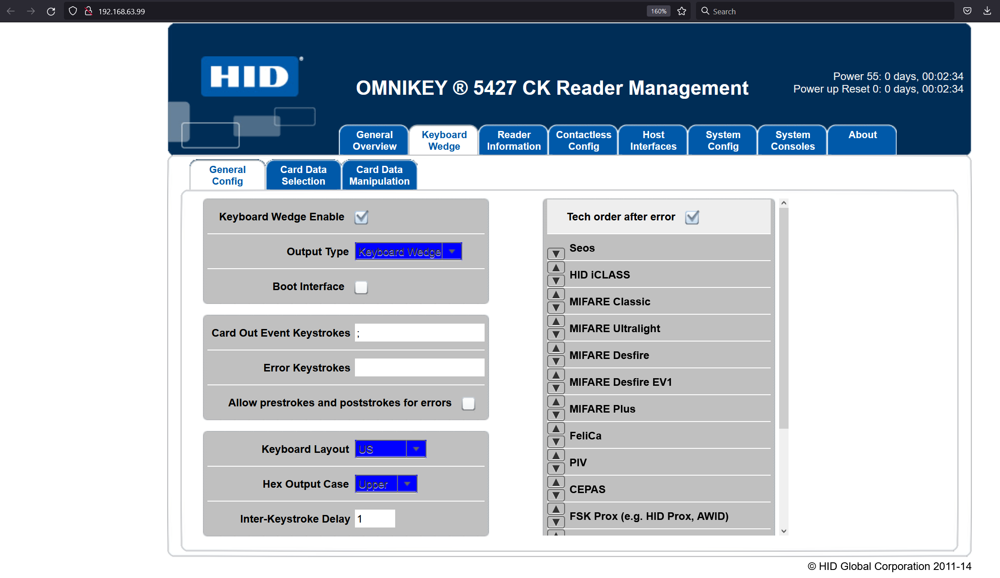
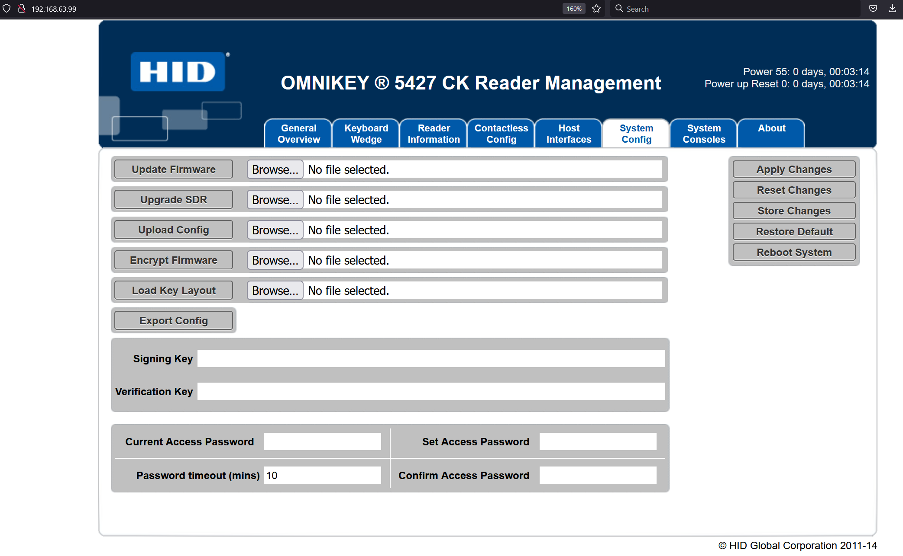

# Installation
## 1. Directus V9 installeren
Volg installatie guide van Directus [hier](https://docs.directus.io/getting-started/installation/cli/).

In de databank verwijder alle tabellen aangemaakt door Directus. Voer het SQL-script `MyPacr/Docker/init.sql` uit. Dit script zorgt voor de correcte tabellen nodig voor MyPacr en plaatst hier begindata in.

Directus is nu klaar. Voor meer informatie over elke collection klik [hier](https://github.com/nrdsbvba/MyPacr/tree/main/Documentatie/Collections.md)

Surf naar [localhost:8055](localhost:8055) en log in met username: `admin@example.com` en password: `qwerty`

## 2. PortalAPi opzetten
Installeer [Node.js](https://nodejs.org/en/download/)

Download het PortalAPI project van [github](https://github.com/nrdsbvba/MyPacr/tree/main/MyPacr.PortalApi).

In `PortalApi/config/` hernoem `example.json` naar `default.json`
Pas alle gegevens aan:
- **directusSettings**
	- url: De url waar directus zich bevindt.
	- projectUrl: Dit is het Directus project token, laat dit op "_" staan.
	- token: zie de [Static Tokens](https://v8.docs.directus.io/api/authentication.html#tokens) op Directus V8 Docs.
	- databaseSettings: De login en naam van de databank.
- **portalSettings**
	- De url van het portalFront en de API.
- **paymentProvider**
	- De api key van het [mollie](https://www.mollie.com/be) betaling systeem.
- **localizationSettings**
	- De taal en tijdzone.
- **passport**
	- **TODO**
- **jwt**
	- **TODO**
- **smartschoolAuthentication**
	- Login gegevens om te synchroniseren met smartschool.
- **reporting**
	- Wachtwoord om te rapporteren. Zie '7. sync en reporting passphrases' onderaan.
- **syncPassphrases**
	- Synchronisatie wachtwoorden. Zie '7. sync en reporting passphrases' onderaan.
- **mail**
	- Mail instellingen, vanwaar, en welk account worden automatische mails verstuurd.

Na alles correct te hebben ingesteld, voer `node ./src/server.js` uit om de API te starten.

## 3. PortalFront opzetten

Download het PortalFront project van [github](https://github.com/nrdsbvba/MyPacr/tree/main/MyPacr.PortalFront).

Maak een bestand aan in de root folder genaamd `.env`.
Plaats het volgende in dit bestand en pas de parameters aan naar wens:
```
API_URL=http://localhost:80/api
API_PORTALFRONT=http://localhost:3000
SMARTSCHOOL_URL=schoolnaam.smartschool.be
SMARTSCHOOL_CLIENTID=123456abc
```
> PAS OP: Zorg dat er zich geen spaties in dit bestand bevinden.

> Alternatief: plaats deze gegevens in systeem-variabelen.

- API_URL is de url van het PortalAPI project
- API_PORTALFRONT is de url van het PortalFront project
- SMARTSCHOOL_URL is de url van smartschool
- SMARTSCHOOL_CLIENTID is de id van smartschool. **TODO**

Zorg dat PortalAPI en Directus draaien en dat Terminal niet draait op deze PC.
Voer het commando `node ./node\_modules/nuxt/bin/nuxt.js` uit om het PortalFront project te starten.

Surf naar [`localhost:3000`](localhost:3000).
En gebruik de volgende login
email: `example@mypacr.be` en wachtwoord: `qwerty`

> Alternatief: Maak een nieuw account aan [localhost:3000/registreren](localhost:3000/registreren)

## 4. Terminal opzetten
Download het PortalFront project van [github](https://github.com/nrdsbvba/MyPacr/tree/main/MyPacr.Terminal).

Maak een bestand aan in de root folder genaamd: `.env`
Plaats het volgende in dit bestand:
```
DIRECTUS_API_URL=http://localhost
DIRECTUS_API_TOKEN="token"
```
> PAS OP: Plaats geen spaties, voor of na de lijnen of de gelijkheids tekens.

> Alternatief: plaats deze gegevens in systeem-variabelen

- DIRECTUS_API_URL is de url waar Directus draait.
- DIRECTUS_API_TOKEN is dezelfde [Static Token](https://v8.docs.directus.io/api/authentication.html#tokens) ingevuld in het PortalAPI-config bestand.

Zorg dat PortalAPI en Directus draaien en dat PortalFront niet draait op deze PC.
Voer het commando `node ./node\_modules/nuxt/bin/nuxt.js` uit om het Terminal project te starten.

Surf naar `localhost:3000/` en login met dezelfde login als Directus.

## 5. Omnikey 5427 CK Smart-card readers
De aangerade smart-card readers zijn de [Omnikey 5427 CK ](https://www.hidglobal.com/products/readers/omnikey/5427).

Aan 1 terminal kunnen 2 van deze lezers verbonden worden. Een voor het afrekenen van bestellingen, en een andere die enkel aanwezigheid registreert. Als de code die de lezer geeft eindigt op een `;`, wordt deze enkel gebruikt om aanwezigheid te registreren.

Om de Omnikey 5427 CK in te stellen om elke lezing te eindigen met een `;` moet eerst de driver geinstaleerd worden, deze is [hier](https://www.hidglobal.com/drivers/28595) te vinden.

Verbind vervolgens de card-reader via USB en surf naar [`http://192.168.63.99`](http://192.168.63.99)
Klik op het tweede tab `Keyboard wedge` en vul `;` in bij `Card Out Event Keystroke`.



Ga naar het voorlaatste tab `System Config`, klik op `Apply changes` en vervolgens op `Store changes`.



De lezer geeft nu na elke lezing ook een `;`.

## 6. Mollie betalingsysteem
Surf naar [Mollie.com](https://www.mollie.com/be) en maak een account aan.

Er is onmiddelijk een test api key beschikbaar. Om een live api key te krijgen moet je eerst je account verder activeren.

Deze api key kan je invullen in de settings van het PortalAPI project.

> Het portalAPI project moet bereikbaar zijn via het internet om (echte of test) betalingen te kunnen uitvoeren

## 7. sync en reporting passphrases.

Maak een POST request naar de API endpoints in [syncController](https://github.com/nrdsbvba/MyPacr/blob/main/MyPacr.PortalApi/src/controllers/syncController.js) of naar [reportingController](https://github.com/nrdsbvba/MyPacr/blob/main/MyPacr.PortalApi/src/controllers/reportingController.js). In de body van het request plaats:
```
{
	"passphrase" : "specificPassphrase"
}
```

> Let op dat deze requests niet te vaak gebeuren! Te veel requests naar smartschool kan het account blokkeren of de API vertragen.

Het is aangeraden deze requests te maken met een tool zoals [Postman](https://www.postman.com/)

## 8. Rapportage extensie

Download het Rapportage project van [github](https://github.com/nrdsbvba/MyPacr/tree/main/Raportage).

Voer `npm install` uit in de root-folder om de nodige npm pakketen te installeren.
Voer vervolgens `npm run build` uit.

Kopieer het `index.js` van `./dist` naar `directus/extensions/modules/Rapportage`
> Maak de folders aan indien nodig.

Maak in de folder Rapportage een nieuw bestand aan genaamd `environmentConfig.json` en plaats het volgende in dit bestand (pas aan waar nodig):
```
{
  "environment": "development",
  "directusSettings": {
    "token": "directus_token",
    "url": "http://localhost:80"
  },
  "portalSettings": {
    "fileLink": "http://localhost:80",
    "apiUrl": "http://localhost:80/api",
    "tokenSettings": {
      "passphrase": "ABC123HIJ",
      "key": "JWTSecret"
    }
  }
}
```
Er is nu een nieuw tab beschikbaar in het Directus dashboard waar rapporten kunnen worden gegenereerd.


